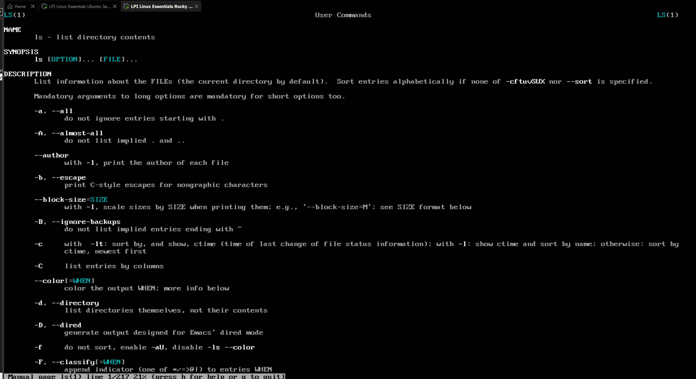

# 🐧 Linux Essentials Lab (LPI 010-160)

This project documents my hands-on practice for the **Linux Essentials (010-160)** exam objectives.  
The lab was built with **VMware Workstation/Fusion**, using both **Rocky Linux 9 (Minimal)** and **Ubuntu 24.04 LTS**.  

Most screenshots were taken in **Rocky Linux**, but I worked across both VMs to highlight similarities and differences between Debian-based and RHEL-based systems.

---

## 🎯 Learning Objectives (mapped to 010-160)

- Linux & open source basics (distros, licensing, help systems)  
- Navigation & files (paths, wildcards, text viewing)  
- Command line power (pipes, redirection, search, editors)  
- OS & processes (boot, services, logs, hardware)  
- Security & permissions (users, groups, chmod/chown, ACLs)  
- Networking basics (IPs, routes, name resolution, firewalls)  
- Package managers (APT on Ubuntu, DNF on Rocky)  
- Scripting & automation (bash fundamentals, cron)  
- Troubleshooting (DNS, fstab, etc.)

---

## 🧱 Lab Topology

### Ubuntu VM
- **Ubuntu 24.04 LTS**
- 2 vCPU, 8 GB RAM, 40 GB disk
- NAT adapter (VMnet8)
- Packages: `open-vm-tools`, `curl`, `wget`, `nano`, `less`, `man-db`

---

### Rocky VM
- **Rocky Linux 9 (Minimal)**
- 2 vCPU, 7.5 GB RAM, 40 GB disk
- NAT adapter (VMnet8)
- Packages: `open-vm-tools`, `curl`, `wget`, `nano`, `less`, `man-pages`

---

## 🖼️ Screenshots

### 1. System Identity & Release Info
- `uname -a`, `/etc/os-release`, `hostnamectl`  
- Both Ubuntu and Rocky release identifiers  

  
  
  

---

### 2. Navigation & Files
- `pwd`, `ls -lah`, `cd`, `mkdir`, `touch`, `cp`, `mv`, `rm`  
- Tree view of nested directories  

  
  
  

---

### 3. Text Viewing & Editing
- `man ls`, `less`, `nano` editor, writing scripts  

  
  

---

### 4. Command Line Power
- Pipes and redirection  

---

### 5. Packages & Repositories
- APT (Ubuntu) vs DNF (Rocky)  
- Installing, inspecting, and removing packages  

---

### 6. Users, Groups, Permissions
- Adding users, group membership, sudo/wheel access  
- Ownership and file permissions  
- ACLs (Access Control Lists)  
- Sticky bit/shared directories  

  
  
  

---

### 7. Processes, Services, and Logs
- `ps aux`, `pgrep`, `systemctl`, `journalctl`  
- Service management  

---

### 8. Hardware & Storage
- Inspecting CPU and block devices  
- Mounting loopback devices

  

---

### 9. Networking & Name Resolution
- `ip a`, `ip r`, `ping`, `curl`, `host`, `getent hosts`  
- Configuring firewalls  

  

---

### 10. Bash, Scripts, and Automation
- Writing and running bash scripts  
- Cron jobs (`crontab -e`, `crontab -l`)
See /scripts/quickbackup.sh for the full backup script used in this lab

  
  

---

### 11. Break/Fix Drills
- DNS misconfiguration and recovery  
- fstab errors and fixes  

  

---

## ✅ Self-Test Checklist

- Identify kernel & distro (`uname -r`, `/etc/os-release`)  
- Navigate with absolute/relative paths and wildcards  
- Install/remove packages with APT and DNF  
- Manage users, groups, and permissions (chmod, chown, ACLs)  
- Inspect processes/services with `systemctl` and `journalctl`  
- Configure IPs, routes, and name resolution  
- Write/run a bash script and schedule with `cron`  
- Mount and test filesystems with `/etc/fstab`  
- Troubleshoot common issues (DNS, fstab)  

---

## 📚 Notes

This lab shows practical Linux skills across **two families of distributions**:  
- **Debian-based (Ubuntu)** → APT package manager  
- **RHEL-based (Rocky)** → DNF package manager  

Practicing on both clarified differences in package handling, service names, log locations, and firewall tools.
